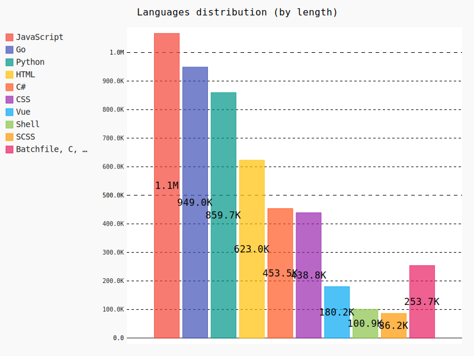

# Guionardo's github profile report

I am Guionardo, a passionate software developer and open source enthusiast.

---

---

---

---

## Monitored Organizations and Users

| Name | Type | Location | Description |
|----|-----|----|---|
|Projeto Escoteirando | Organization | Brazil | No description |
|Guionardo Furlan | User | Blumenau/SC/Brasil |  |

## Last Updated Repositories

| Repository | Description | Last Commit | Status |Languages|
|----|-----|----|---|---|
| [guiosoft-scripts](https://github.com/guionardo/guiosoft-scripts) | Automation scripts for every day | <a href="https://api.github.com/repos/guionardo/guiosoft-scripts/git/commits/9e13311c6b606e379effb27bdf6120d2a771dbb2" title="guionardo @ 2026-02-06 12:42:58+00:00"><small>9e13311c</small></a><pre>[AUTO-COMMIT] Updated README.md software versions</pre> | 🚀|Shell, Python
| [dev](https://github.com/guionardo/dev) | Development tools and setup scripts | <a href="https://api.github.com/repos/guionardo/dev/git/commits/24c229b942a8e68700f07a669418efba4bb2e616" title="Guionardo Furlan @ 2026-02-06 11:13:17+00:00"><small>24c229b9</small></a><pre>Initial commit</pre> | 🚀|N/A
| [go](https://github.com/guionardo/go) | Golang tools, examples, and packages | <a href="https://api.github.com/repos/guionardo/go/git/commits/904417edab15ea3e2ded43188db35e7dd3e1d407" title="Guionardo Furlan @ 2025-12-29 17:32:08+00:00"><small>904417ed</small></a><pre>Merge pull request #34 from guionardo/feature/packages  chore(package): move packages to root</pre> | 🦥|Go, Makefile
| [govuln](https://github.com/guionardo/govuln) | govulncheck pre-commit  | <a href="https://api.github.com/repos/guionardo/govuln/git/commits/2d6c89d4ce224449925c8c2c023029624e352217" title="Guionardo Furlan @ 2025-10-27 23:47:41+00:00"><small>2d6c89d4</small></a><pre>Fix badge link in README.md</pre> | 🦥|Go, Makefile
| [go-router](https://github.com/guionardo/go-router) | Friendly router for REST APIs | <a href="https://api.github.com/repos/guionardo/go-router/git/commits/9b8ddd365c3e90635b598f92b4680f80c6ebc53c" title="Guionardo Furlan @ 2025-08-07 05:07:21+00:00"><small>9b8ddd36</small></a><pre>Create go.yml</pre> | 🦥|N/A
| [go-dev-monitor](https://github.com/guionardo/go-dev-monitor) | Repository local monitor for multiple environments | <a href="https://api.github.com/repos/guionardo/go-dev-monitor/git/commits/7a4e1f02cb22c7219d40f4dc27f690c3356db918" title="Guionardo @ 2025-07-09 19:15:36+00:00"><small>7a4e1f02</small></a><pre>Fixed debug logging</pre> | 💤|Go, JavaScript, HTML, Vue, CSS, SCSS
| [docs](https://github.com/guionardo/docs) | No description | <a href="https://api.github.com/repos/guionardo/docs/git/commits/be7fa61d60946f7e882a7de7a4af9911124b91f0" title="Guionardo Furlan @ 2025-06-29 14:02:36+00:00"><small>be7fa61d</small></a><pre>Initial commit</pre> | 💤|MDX
| [escoteirando-atividades](https://github.com/escoteirando/escoteirando-atividades) | Criação de atividades escoteiras | <a href="https://api.github.com/repos/escoteirando/escoteirando-atividades/git/commits/5d386188884a853c05222c522623a87e64db12fa" title="Guionardo Furlan @ 2025-06-06 00:08:42+00:00"><small>5d386188</small></a><pre>Initial commit</pre> | 💤|N/A
| [go-parallel](https://github.com/guionardo/go-parallel) | Parallel/concurrent helpers | <a href="https://api.github.com/repos/guionardo/go-parallel/git/commits/4a1dc9e6c49d1a71dd8155102b98e3e93b419591" title="Guionardo Furlan @ 2025-05-19 17:45:03+00:00"><small>4a1dc9e6</small></a><pre>Initial commit</pre> | 💤|N/A
| [go-ntfy-sink](https://github.com/guionardo/go-ntfy-sink) | No description | <a href="https://api.github.com/repos/guionardo/go-ntfy-sink/git/commits/f7a5722611748f8c8f6a9df42b03e01b8ca48d72" title="Guionardo Furlan @ 2025-05-18 12:53:24+00:00"><small>f7a57226</small></a><pre>Initial commit</pre> | 💤|N/A

### Significant Languages

| Language | Repositories | Total Bytes | Greater Repo |
|---|---|---|---|
| JavaScript | 28 | 1068434 | guionardo/palestra-case-platform (469190) |
| Go | 23 | 915781 | escoteirando/escoteirando-bot (164418) |
| Python | 26 | 859716 | guionardo/hbsis_kb (301978) |
| HTML | 22 | 625805 | guionardo/ambevtech-csharp (234849) |
| C# | 15 | 453485 | guionardo/gs-loader (212556) |
| CSS | 12 | 439182 | guionardo/GitTrainingWall (305777) |
| Vue | 12 | 180188 | escoteirando/escoteirando_fastapi (54948) |
| Shell | 16 | 100910 | guionardo/dotfiles-public (49549) |
| SCSS | 9 | 86228 | guionardo/palestra-case-platform (79740) |
| Batchfile, C, C++, Dockerfile, Elm, Java, Jupyter Notebook, MDX, Makefile, Mako, PHP, Pascal, Perl, PowerShell, PureBasic, Ruby, TypeScript, xBase | 42 | 257763 | None (0) |

---

## Daily joke from <a href="https://official-joke-api.appspot.com/">official-joke-api</a>

>What do vegetarian zombies eat?

>Grrrrrainnnnnssss.

---

---

*Generated with [Guionardo's README Generator] @ 2026-02-07T00:42:12.140669+00:00 UTC*