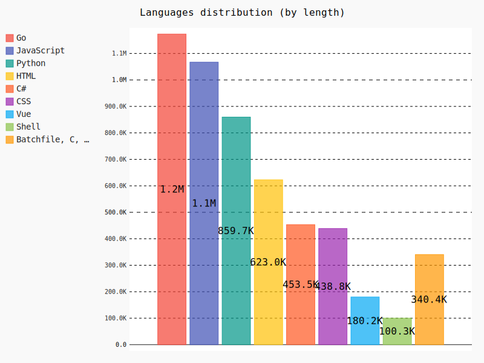

# Guionardo's github profile report

I am Guionardo, a passionate software developer and open source enthusiast.

---

---

---

---

## Monitored Organizations and Users

| Name | Type | Location | Description |
|----|-----|----|---|
|Projeto Escoteirando | Organization | Brazil | No description |
|Guionardo Furlan | User | Blumenau/SC/Brasil |  |

## Last Updated Repositories

| Repository | Description | Last Commit | Status |Languages|
|----|-----|----|---|---|
| [guiosoft-scripts](https://github.com/guionardo/guiosoft-scripts) | Automation scripts for every day | <a href="https://api.github.com/repos/guionardo/guiosoft-scripts/git/commits/3e123f9d158582abb87787ea0ee831c8925170ad" title="guionardo @ 2026-06-25 01:22:11+00:00"><small>3e123f9d</small></a><pre>[AUTO-COMMIT] Updated README.md software versions</pre> | 🚀|Shell, Python
| [guiosoft-infra](https://github.com/guionardo/guiosoft-infra) | Automação para instalação de recursos nos sistemas GuioSoft | <a href="https://api.github.com/repos/guionardo/guiosoft-infra/git/commits/eae6f2e157cac2dd7ea18ca1ea6798a700f23b90" title="Guionardo Furlan @ 2026-06-24 10:46:45+00:00"><small>eae6f2e1</small></a><pre>Merge pull request #3 from guionardo/guionardo-patch-1  Add LAB.md for documenting new services</pre> | 🚀|Python, Shell, Jinja
| [gs-dev](https://github.com/guionardo/gs-dev) | Development assistant | <a href="https://api.github.com/repos/guionardo/gs-dev/git/commits/7e5fddbd4368ed39d27f952b7a9aa807fdb76f13" title="Guionardo Furlan @ 2026-05-23 00:00:45+00:00"><small>7e5fddbd</small></a><pre>Merge pull request #13 from guionardo/guionardo-patch-1  Update Go Release badge in README.md</pre> | 🦥|Go, Makefile
| [go](https://github.com/guionardo/go) | Golang tools, examples, and packages | <a href="https://api.github.com/repos/guionardo/go/git/commits/c6503613332ce2c54e093d601e390833c1d6bfc5" title="Guionardo Furlan @ 2026-05-22 23:57:41+00:00"><small>c6503613</small></a><pre>Update CHANGELOG for version 1.3 release</pre> | 🦥|Go, Makefile
| [git-sync-status](https://github.com/guionardo/git-sync-status) | Tool to verify whether a folder is a Git repository and report sync status between local and remote branches. | <a href="https://api.github.com/repos/guionardo/git-sync-status/git/commits/49c0c8d8dcae78646e9e15ec046a0c9fa6c6984c" title="Guionardo Furlan @ 2026-02-13 12:25:48+00:00"><small>49c0c8d8</small></a><pre>Merge pull request #1 from guionardo/feature/setup  feature: first implementation</pre> | 🦥|Go, Makefile
| [dev](https://github.com/guionardo/dev) | Development tools and setup scripts | <a href="https://api.github.com/repos/guionardo/dev/git/commits/24c229b942a8e68700f07a669418efba4bb2e616" title="Guionardo Furlan @ 2026-02-06 11:13:17+00:00"><small>24c229b9</small></a><pre>Initial commit</pre> | 🦥|N/A
| [govuln](https://github.com/guionardo/govuln) | govulncheck pre-commit  | <a href="https://api.github.com/repos/guionardo/govuln/git/commits/2d6c89d4ce224449925c8c2c023029624e352217" title="Guionardo Furlan @ 2025-10-27 23:47:41+00:00"><small>2d6c89d4</small></a><pre>Fix badge link in README.md</pre> | 💤|Go, Makefile
| [go-router](https://github.com/guionardo/go-router) | Friendly router for REST APIs | <a href="https://api.github.com/repos/guionardo/go-router/git/commits/9b8ddd365c3e90635b598f92b4680f80c6ebc53c" title="Guionardo Furlan @ 2025-08-07 05:07:21+00:00"><small>9b8ddd36</small></a><pre>Create go.yml</pre> | 💤|N/A
| [go-dev-monitor](https://github.com/guionardo/go-dev-monitor) | Repository local monitor for multiple environments | <a href="https://api.github.com/repos/guionardo/go-dev-monitor/git/commits/7a4e1f02cb22c7219d40f4dc27f690c3356db918" title="Guionardo @ 2025-07-09 19:15:36+00:00"><small>7a4e1f02</small></a><pre>Fixed debug logging</pre> | 💤|Go, JavaScript, HTML, Vue, CSS, SCSS
| [docs](https://github.com/guionardo/docs) | No description | <a href="https://api.github.com/repos/guionardo/docs/git/commits/be7fa61d60946f7e882a7de7a4af9911124b91f0" title="Guionardo Furlan @ 2025-06-29 14:02:36+00:00"><small>be7fa61d</small></a><pre>Initial commit</pre> | 💤|MDX

### Significant Languages

| Language | Repositories | Total Bytes | Greater Repo |
|---|---|---|---|
| Go | 24 | 1173324 | guionardo/gs-dev (229953) |
| JavaScript | 28 | 1068434 | guionardo/palestra-case-platform (469190) |
| Python | 27 | 895194 | guionardo/hbsis_kb (301978) |
| HTML | 22 | 625805 | guionardo/ambevtech-csharp (234849) |
| C# | 15 | 453485 | guionardo/gs-loader (212556) |
| CSS | 12 | 439182 | guionardo/GitTrainingWall (305777) |
| Vue | 12 | 180188 | escoteirando/escoteirando_fastapi (54948) |
| Shell | 15 | 105821 | guionardo/dotfiles-public (49549) |
| Batchfile, C, C++, Dockerfile, Elm, Java, Jinja, Jupyter Notebook, MDX, Makefile, Mako, PHP, Pascal, Perl, PowerShell, PureBasic, Ruby, SCSS, TypeScript, xBase | 45 | 344937 | None (0) |

---

## Daily joke from <a href="https://official-joke-api.appspot.com/">official-joke-api</a>

>Why dot net developers don't wear glasses?

>Because they see sharp.

---

---

*Generated with [Guionardo's README Generator] @ 2026-06-25T12:58:04.545413+00:00 UTC*