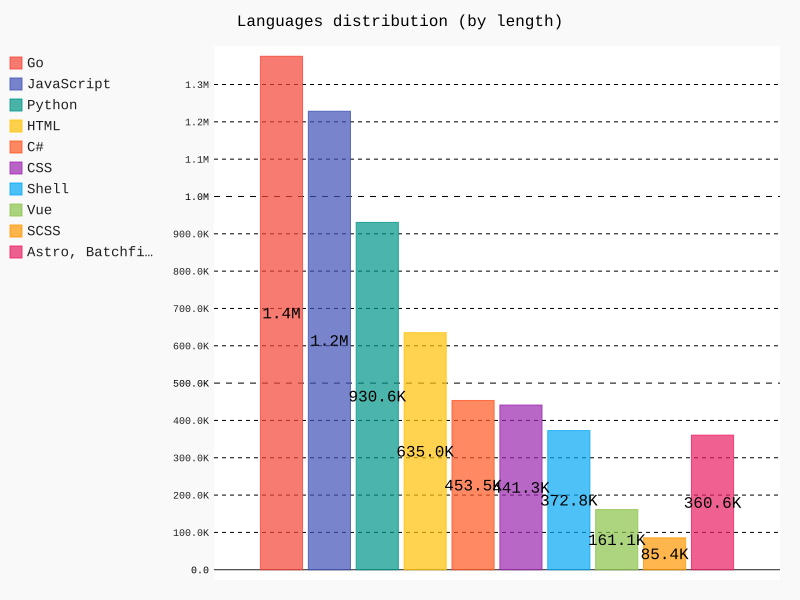

# Guionardo's github profile report

I am Guionardo, a passionate software developer and open source enthusiast.

---

---

---

---

## Monitored Organizations and Users

| Name | Type | Location | Description |
|----|-----|----|---|
|Projeto Escoteirando | Organization | Brazil | No description |
|Guionardo Furlan | User | Blumenau/SC/Brasil |  |

## Last Updated Repositories

| Repository | Description | Last Commit | Status |Languages|
|----|-----|----|---|---|
| [go](https://github.com/guionardo/go) | Golang tools, examples, and packages | <a href="https://api.github.com/repos/guionardo/go/git/commits/ea54bd1ec8e33cf881c73b568896dc65b4b1c28f" title="Guionardo Furlan @ 2026-10-09 00:52:27+00:00"><small>ea54bd1e</small></a><pre>feat(v1.8): SQLite cache backend — provider foundation, batch surface & multi-process hardening (#48)  * feat(v1.7): project probe package — 7-language detection (squash merge of gsd/v1.7-project-probe)  * docs: update retrospective for v1.7  * docs(10-13): extract learnings from archived phase artifacts  * docs(14): regenerate learnings with UAT results  * chore: complete v1.7 archive move, whitespace cleanup, config profile  * chore: remove stale .planning/phases dirs after v1.7 archive move  * docs: capture exploration — sqlite-cache-backend  * docs: start milestone v1.8 SQLite Cache Backend  * docs: complete project research  * docs: define milestone v1.8 requirements  * docs: create milestone v1.8 roadmap (3 phases)  * docs: tag 1 pending todos with resolves_phase after milestone v1.8 roadmap  * docs(15): capture phase context  * docs(state): record phase 15 context session  * docs(15): research phase domain  * docs(15): create phase plan  * fix(15): revise plans based on checker feedback  * docs(15): update state and roadmap annotations  * feat(15-01): add sqlite cache provider foundation (memory mode end-to-end)  - add modernc.org/sqlite v1.60.1 with exact modernc.org/libc v1.77.1 pin - cache/sqlite: provider implementing the 7-method cacher interface via NewConcreteCache - DSN-carried pragmas, pinned single-connection pool, BEGIN IMMEDIATE bootstrap - deferred initErr errors, ErrClosed/ErrInvalidPath sentinels, loop-based batch placeholders (Phase 16 TODO) - unit tests for location resolution, options, resolveTTL plus memory roundtrip smoke  * feat(15-01): add file-mode location resolution, DSN pragmas, and idempotent bootstrap  - warn-only journal_mode read-back after bootstrap (never fails construction) - pool-pinning assertion, pragma read-back (wal/5000/1), bootstrap idempotence - file CRUD and spaces-in-path coverage via WithPath  * feat(15-01): harden sqlite error taxonomy and pin GetOrSet dedup parity  - deferred ErrInvalidPath through initErr, ErrClosed taxonomy, idempotent Close - corrupted-row and marshal-failure paths never map to cache.ErrMiss - concurrent GetOrSet dedup (setter once under -race), memory isolation, fmt.Sprint/json parity - unit tests for location matrix, options defaults, resolveTTL; lint-clean package  * docs(15-01): complete sqlite cache provider foundation plan  * feat(15-02): add TTL expiry semantics and sweep-on-open  - SweepSQL deletes only rows with expires_at IS NOT NULL AND expires_at <= bound now (partial-index shape) - sweep.go: best-effort sweep(ctx) — failures log via logger().Warn and never propagate (D-09) - open() runs the sweep synchronously before New returns (D-10), skipping failed opens - TestResolveTTL matrix extended in place: negative and multiple-ttl inputs follow postgres parity - TestReadsNeverDeleteRows proves filter-only reads keep the row (COUNT stays 1) - TestSweepOnOpen proves expired rows are reclaimed on open while unexpired rows survive - TestTTLExpiry/TestDefaultTTLExpiry/TestNoExpiry cover per-call, default, and none expiry  * feat(15-02): add opt-in periodic sweep with clean Close cancellation  - Config.SweepInterval + WithSweepInterval(d): default is no sweeper (D-08 divergence from mem/postgres) - sweepLoop ticker select on c.stop with defer close(c.done); ticks cannot overlap on the pinned connection - startSweeper() launches the goroutine only when the interval is positive; d <= 0 leaves stop/done nil - CloseFunc cancels and waits for the sweeper before closing the DB; idempotent second Close returns nil - TestPeriodicSweep reclaims a post-open expired row via require.Eventually on the raw row count - TestSweeperDisabled proves no goroutine/channels for unset, zero, or negative intervals - TestOptions_WithSweepInterval covers the option and its zero default  * test(15-02): prove close lifecycle, sidecar removal, and reopen persistence  - TestSidecarRemoval: -wal/-shm absent and db file present after Close (require.Eventually, Windows-tolerant) - TestReopenPersistence: unexpired entries (no-TTL + 1h TTL) survive Close/reopen plus a post-reopen roundtrip - TestExpiryAcrossRestart: a TTL elapsed across restart is ErrMiss after reopen (sweep or read filter) - TestCloseAfterDeferredError / TestDoubleClose: cleanup is nil even on deferred-error handles; sequential and 8-way concurrent Close are serialized by the CAS guard - TestClosedErrorPrefix: post-Close ops carry the cache/sqlite: prefix with errors.Is(ErrClosed)  * docs(15-02): complete TTL semantics, sweeps, and durability lifecycle plan  * feat(15-03): add Optimizable storage controls and WithAutoCheckpoint  - Optimizable interface (Checkpoint/Vacuum) + batchCache adapter New returns - checkpoint scans the three-column PRAGMA wal_checkpoint(TRUNCATE), busy != 0 errors - WithAutoCheckpoint pages > 0 appends _pragma=wal_autocheckpoint(N) in file mode - read-back tests: configured 200, default 1000, memory mode ignores the option  * test(15-03): harden optimize error states and blocked checkpoint handling  - TestCheckpointBlocked: second connection holding a read transaction makes Checkpoint error with busy (never silent nil) - TestOptimizableClosed/TestOptimizableDeferredErr: wrapped ErrClosed and ErrInvalidPath with cache/sqlite: prefix - TestCheckpointColumns: three-column scan proven, driver errors wrapped  * docs(15-03): document sqlite provider, add example, and index it in the README  - doc.go: usage, location precedence, TTL semantics, persistence/:memory: model, WAL note - example_test.go: runnable in-memory Set/Get example (no skip helper) - README: package index row + provider table row for cache/sqlite  * docs(15-03): complete optimizable storage controls and package docs plan  * docs(phase-15): add security threat verification  * docs(15): add code review report  * docs(15): record code review disposition  * docs(phase-15): complete phase execution  * docs(16): capture phase context  * docs(state): record phase 16 context session  * docs(16): research batch surface and multi-process hardening  * docs(16): create phase plan  * fix(16): revise plans based on checker feedback  * fix(16): revise plans based on checker feedback (round 2)  * docs(16): create phase plan  * test(16-01): add two-process WAL spike harness (raw vs bounded-retry policy arms)  - e2e-tagged TestMain helper-process harness: parent spawns two children on   one shared fresh cache file; each child runs 100 point upsert/read-backs,   10x20 prepared-upsert batch transactions, and a final role marker - raw arm (SQLITE_E2E_RETRY=0) reproduces DI-15-01 cross-process: 8/10 runs   failed with immediate SQLITE_BUSY at PingContext (busy handler bypassed) - policy arm (5 ms backoff / 5 s absolute budget / busy-only classifier at   the connection-establishment seam): 25/25 clean runs, journal_mode=wal,   integrity_check=ok, 301 rows per role  * docs(16-01): record two-process WAL spike evidence (D-11)  - Harness shape: TestMain helper-process re-exec, env contract, iterations=100,   DSN/schema mirrors and their Plan 16-04 elimination - Raw arm: 8/10 runs failed with immediate SQLITE_BUSY at the ping (DI-15-01   cross-process reproduction; research probe prior 16/30) - Policy arm: 30/30 clean, journal_mode=wal, integrity_check=ok, 301 rows per   role (research probe prior 30/30) - Confirmed policy: 5 ms backoff / 5 s budget / busy-only Code()&0xff==5 at the   PingContext seam; disposition to Plan 16-02 (open()) and Plan 16-04 (crash   arm + CI)  * docs(16-01): complete two-process WAL spike plan  * feat(16-02): bounded busy-only retry for the first-open WAL conversion race (D-06, DI-15-01)  - retry.go: busyErr interface + isBusyError classifier (errors.As, Code()&0xff==5,   extended codes 261/517 covered) + busyTimeout/busyBackoff consts + retryBusy/   retryBusyWithin deadline loop; no driver import (blank import stays in sqlite.go) - sqlite.go open(): single retryBusy(ctx, c.db.PingContext) call between pool   pinning and bootstrap; exhaustion closes the handle and rides New's deferred   initErr — New stays never-failing - retry_internal_test.go: fake-error classifier matrix, millisecond-budget loop   tests (busy-then-nil, exhaustion, ctx cancel), TestBusyTimeoutDSNSync pins the   budget to the DSN busy_timeout=5000 literal - concurrent first-open regression green -count=20 (was ~5-12% flaky, DI-15-01)  * feat(16-02): bound WAL growth via journal_size_limit DSN pragma (D-08)  - dsn.go: dsnJournalSizeLimitPrefix + journalSizeLimitBytes (64 << 20) constants;   buildDSN gains the 4-arg signature (path, memory, autoCheckpointPages,   journalSizeLimit) appending autocheckpoint then journal_size_limit, both   gated positive-only (no sentinel semantics), strconv-formatted only (A6);   memory mode omits both - sqlite.go: open() call site passes journalSizeLimitBytes - dsn_internal_test.go: TestDSNBuildDSN extended in place (single owner) —   journal-only, both-pragmas-in-order, non-positive no-ops, memory omission - sqlite_internal_test.go: TestJournalSizeLimitReadBack — file reads back   67108864, memory keeps SQLite's -1 default, 200/67108864 coexist on one   pinned connection; readJournalSizeLimit helper mirrors readAutoCheckpoint  * test(16-02): prove bounded BEGIN contention with no provider-side retry (CONC-02)  - TestBeginContentionBounded: second raw handle holds BEGIN IMMEDIATE via the   production DSN; provider SetFunc returns a busy-classified error wrapped with   the cache/sqlite: prefix in under two busy_timeout periods (D-07: no retry   beyond the open window); after rollback the identical write succeeds - opens with buildDSN(path, false, 0, journalSizeLimitBytes) — exercises the   Task 2 DSN in the blocked-handle path  * docs(16-02): complete bounded open retry and journal_size_limit plan  * feat(16-03): chunked MGet with dedup, re-keying, and warn-and-skip (BATCH-01)  - batch.go: chunkSize=100 const, uniqueKeys (stringified-form dedup,   first-seen order), chunksOf (order-preserving size-bounded slices),   inPlaceholders (? marker list only — no caller data in SQL) - MGetFunc: one IN query per 100-key chunk with the expiry predicate   folded into MGetSelectSQL; per-chunk map[string]K re-keys rows to the   original K (fmt.Sprint is not invertible, Finding 5); chunk failures   warn+skip per D-03; decode failures skip at debug; rows fully drained   and closed before the next chunk (pinned 1-conn pool) - schema.go: MGetSelectSQL (cache_key + value) and MDelSQL templates - sqlite.go: three Phase 15 loop placeholders removed (MGet moved) - tests: helper matrix (TestUniqueKeys/TestChunksOf/TestInPlaceholders)   and TestMGetFunc behavior matrix (empty no-op, fresh, duplicate,   expired-retained, corrupt-skip, chunk-failure, closed, cross-chunk   150 keys) + black-box TestBatchMGet (missing subset, empty args, TTL) - placeholder smoke test replaced by TestBatchMGet pending the full   TestBatchSemantics replacement in this plan's Task 3  * feat(16-03): atomic prepared-upsert MSet + chunked MDel (BATCH-02, BATCH-03)  - MSetFunc: pre-marshal every pair before BeginTx (D-04 — a marshal   error writes nothing), resolveTTL exactly once for the batch (mem   parity), one BEGIN IMMEDIATE transaction via _txlock, one prepared   UpsertSQL, one ExecContext per pair, Commit; defer Rollback is the   atomicity backstop on every error path (marshal/begin/prepare/exec/   commit) — the 0-or-all invariant holds under context cancellation - MDelFunc: chunked IN-list deletes over deduplicated keys; missing and   duplicate keys are no-ops; first chunk error returns the wrapped   error (fail-fast, idempotent caller retry — D-05) - schema.go: MDelSQL template beside MGetSelectSQL - batch_index: msetTx extraction keeps MSetFunc at cyclop-clean   complexity while preserving the single-tx shape - tests: TestMSetFunc matrix (empty no-op, marshal atomicity, one TTL   across rows, upsert overwrite, ErrClosed), TestMSetNoPartialWrites   (2000 pairs x 5 iterations, 0-or-all under ~1ms cancellation),   TestMDelFunc matrix (missing, duplicates, 250-key chunks, idempotent   re-run, closed-handle fail-fast), black-box TestBatchMSetOneTTL and   TestBatchMDel at 150 keys  * test(16-03): black-box batch semantics + CONC-03 mixed-op race test  - TestBatchSemantics replaces the placeholder smoke test: MSet->MGet   roundtrip with a missing key absent, MDel idempotency, MGet after   MDel, empty-input no-ops, and one TTL expiring every key of the batch   (mem-parity semantics) - TestConcurrentBatchOpsRace (CONC-03): file and :memory: subtests, 8   goroutines x 50 iterations mixing Set/Get/Delete/MGet(3)/MSet(5)/   MDel/GetOrSet on per-worker prefixed keys, start-channel release,   t.Context() lifecycle — passes go test -race with no DATA RACE   (0.67s memory / 0.74s file) - Package gates: full suite green, make coverage-quick green (81.9%,   no cache/sqlite override), golangci-lint at 0 issues  * docs(16-03): complete batch surface plan (MGet/MSet/MDel + CONC-03)  * test(16-04): drive two-process contention arm through the shipped provider  - helperMain constructs sqlite.New+WithPath; the spike-local retry loop and   SQLITE_E2E_RETRY toggle are gone (the D-06 bounded retry now lives in open()) - mixed D-10A workload: Set/Get, periodic 20-key MSet+MGet, point Delete with   absence verification, chunked MDel, final marker - TestTwoProcessContention (renamed) asserts both children exit 0 plus   journal_mode=wal, integrity_check=ok, deleted keys absent, and exactly   287 rows per role (100 - 14 deletions + 200 batch + 1 marker) - the raw DSN/DDL mirrors remain only for raw test-only handles (parent   verification; the crash child lands in Task 2)  * test(16-04): add kill-mid-write crash-recovery arm to the two-process E2E  - crash child role (SQLITE_E2E_CRASH=1): raw test-only handle, mirrored   bootstrap, BEGIN IMMEDIATE via _txlock with one uncommitted row, marker   file signal (SQLITE_E2E_MARKER), then blocks until killed - TestTwoProcessCrashRecovery: bounded marker wait (2s), survivor driven by   the shipped provider completes with exit 0, killed crasher's wait reports   a non-zero exit (never a specific code/signal), reopen asserts   integrity_check=ok, crash:uncommitted absent, survivor final marker present - every child interaction is timeout-bounded (killChild/waitChild, 60s) and   cleanup Kill+Wait runs for both children  * docs(16-04): wire two-process E2E and race steps into CI, document multi-process contract  - go.yml test matrix gains 'SQLite two-process E2E' (all three OSes, e2e tag,   TestTwoProcess, count=1) and 'SQLite race detector' gated to non-Windows   runners with the C-toolchain rationale comment (Windows -race is a   reviewer-flagged follow-up) - the untagged 'Run tests' step is unchanged so the harness stays invisible   to the unit lane - doc.go Data-and-state paragraph states the CONC-04 contract: same-host   multi-process sharing supported, WAL + busy_timeout bound contention at   BEGIN, bounded busy-only open retry, network/cross-host unsupported, and a   canceled MGet returns partial results (frozen signature, A5)  * docs(16-04): complete provider-driven two-process E2E plan  * docs(16): add code review report  * docs(16): record code review disposition  * test(16): persist human verification items as UAT  * fix(16): WR-01 bound open retry budget to the absolute deadline  * fix(16): WR-02 guard chunksOf against non-positive sizes  * docs(16): add code review fix report  * docs(16): record code review disposition  * fix(16): satisfy wsl_v5 cuddle rule in retryBusyWithin  * docs(16): sync documentation with the sqlite cache backend</pre> | 🚀|Go, Shell, Makefile
| [guiosoft-k3s-lab](https://github.com/guionardo/guiosoft-k3s-lab) | No description | <a href="https://api.github.com/repos/guionardo/guiosoft-k3s-lab/git/commits/375f849377e5c3db9512ad289d16bd15f2386773" title="Guionardo Furlan @ 2026-10-05 18:39:30+00:00"><small>375f8493</small></a><pre>Merge pull request #5 from guionardo/feat/planetapeia  fix(planetapeia): runbook do agente, backup atomico e probes sem senha em argv</pre> | 🚀|Shell, Makefile, Go, Python, HCL, Jinja, Dockerfile
| [gs-secrets](https://github.com/guionardo/gs-secrets) | Poor-man's secret vault: a single-file CLI to store and retrieve API keys, passwords, and other secrets in an AES-256-GCM encrypted local vault.  No cloud, no daemon, no dependencies beyond the Go standard library. Secrets expire on demand with a TTL. | <a href="https://api.github.com/repos/guionardo/gs-secrets/git/commits/33d22f3e942852cd7691c3be82f4fdfd78209f2f" title="Guionardo Furlan @ 2026-10-03 07:23:23+00:00"><small>33d22f3e</small></a><pre>chore: formalize changelog for v0.5.1</pre> | 🚀|Go, JavaScript, PowerShell, Makefile
| [homebrew-tap](https://github.com/guionardo/homebrew-tap) | No description | No commits | 🚀|N/A
| [guionardofurlan.com.br](https://github.com/guionardo/guionardofurlan.com.br) | No description | <a href="https://api.github.com/repos/guionardo/guionardofurlan.com.br/git/commits/6652447115c48bc4e81b6ceacae9c5b31e92d8b3" title="Guionardo Furlan @ 2026-09-20 18:15:06+00:00"><small>66524471</small></a><pre>docs: describe catalog-driven article sync</pre> | 🚀|Astro, HTML, TypeScript, JavaScript, Python, CSS, Makefile
| [ciclo](https://github.com/guionardo/ciclo) | ciclo — framework de IA para o ciclo de desenvolvimento (tasks → spec → código → review → deploy) | <a href="https://api.github.com/repos/guionardo/ciclo/git/commits/87e92f92d8faad99f2a25423552e515180a75209" title="Guionardo Furlan @ 2026-09-09 02:01:53+00:00"><small>87e92f92</small></a><pre>feat: replace Hermes with opencode as required dependency  - cliInstall.js: add opencode install spec (manual + auto per OS) - doctor.js: validate opencode via getCliPath instead of hermes - init.js: auto-install opencode in init (interactive or --yes) - welcome scripts: reference opencode as prerequisite - bump version to 0.1.2</pre> | 🚀|JavaScript, Shell, Makefile
| [guiosoft-scripts](https://github.com/guionardo/guiosoft-scripts) | Automation scripts for every day | <a href="https://api.github.com/repos/guionardo/guiosoft-scripts/git/commits/24681f9c52796bd4211bd180a93c0e9c5bc19412" title="guionardo @ 2026-08-26 13:29:45+00:00"><small>24681f9c</small></a><pre>[AUTO-COMMIT] Updated README.md software versions</pre> | 🦥|Shell, Python
| [mappa_api_client](https://github.com/escoteirando/mappa_api_client) | No description | <a href="https://api.github.com/repos/escoteirando/mappa_api_client/git/commits/1d436b80c788ea8e7a020f613f235c0d5add5135" title="Guionardo Furlan @ 2026-08-12 12:15:49+00:00"><small>1d436b80</small></a><pre>chore: atualiza Makefile para padrão da skill makefile (help agrupado)  - help com awk + grupos ##@ + descrições ## - check targets: gocheck, uvcheck, check-e2e-config - regex corrigido [a-zA-Z0-9_.-] p/ capturar targets com hífen no BSD awk - variáveis GO/UV/PYTEST com ?= - .PHONY por grupo</pre> | 🦥|Python, Go, Makefile
| [go-lock](https://github.com/guionardo/go-lock) | Distributed locking service | <a href="https://api.github.com/repos/guionardo/go-lock/git/commits/85bc21a26e04858f797bf1439f1f8b6956a34b62" title="Guionardo Furlan @ 2026-08-07 17:13:05+00:00"><small>85bc21a2</small></a><pre>Initial commit</pre> | 🦥|N/A
| [mappa-proxy](https://github.com/escoteirando/mappa-proxy) | No description | <a href="https://api.github.com/repos/escoteirando/mappa-proxy/git/commits/0e0c395a9b83f7e8d9ea52149dfc9d7ff5ac8535" title="Guionardo Furlan @ 2026-07-14 21:51:08+00:00"><small>0e0c395a</small></a><pre>chore: update Go version to 1.25 in Dockerfile</pre> | 🦥|Go, JavaScript, Vue, Python, TypeScript, HTML, SCSS, Dockerfile, Makefile

### Significant Languages

| Language | Repositories | Total Bytes | Greater Repo |
|---|---|---|---|
| Go | 27 | 1547232 | guionardo/go (397296) |
| JavaScript | 28 | 1228320 | guionardo/palestra-case-platform (469190) |
| Python | 27 | 930556 | guionardo/hbsis_kb (301978) |
| HTML | 21 | 635016 | guionardo/ambevtech-csharp (234849) |
| C# | 15 | 453485 | guionardo/gs-loader (212556) |
| CSS | 12 | 441255 | guionardo/GitTrainingWall (305777) |
| Shell | 17 | 372800 | guionardo/guiosoft-k3s-lab (249025) |
| Vue | 11 | 161107 | escoteirando/escoteirando_fastapi (54948) |
| SCSS | 8 | 85423 | guionardo/palestra-case-platform (79740) |
| Astro, Batchfile, C, C++, Dockerfile, Elm, HCL, Java, Jinja, Jupyter Notebook, MDX, Makefile, Mako, PHP, Pascal, Perl, PowerShell, PureBasic, Ruby, TypeScript, xBase | 45 | 360563 | None (0) |

---

## Daily joke from <a href="https://official-joke-api.appspot.com/">official-joke-api</a>

>What do you call a bee that lives in America?

>A USB.

---

---

*Generated with [Guionardo's README Generator] @ 2026-10-09T05:42:15.538400+00:00 UTC*