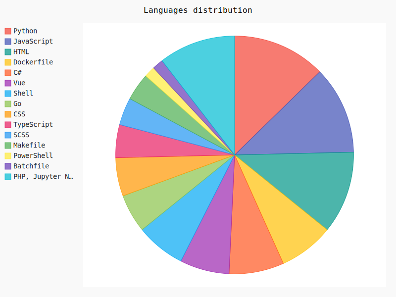
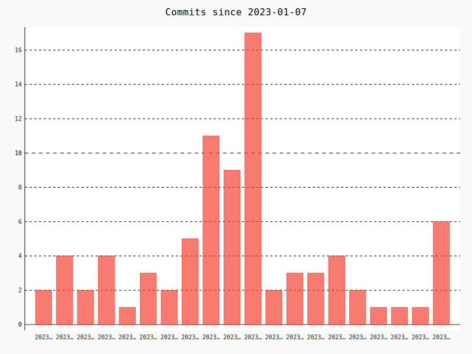

# Guionardo's github profile report

## Repositories (by activity)

### 🦥 Active (more than a month)

        
<a href="https://github.com/guionardo/g-flow" _target="new">guionardo/g-flow</a> : 2023-11-23

        
3:46:28

        
Uma implementação gitflow
        
        
6 commits <a href="https://api.github.com/repos/guionardo/g-flow/git/commits/235b00d6dfc6f4aa7beb67d4c3dd963a0a07621a" title="Guionardo Furlan @ 2023-11-23 14:57:16+00:00">Commit 235b00d6</a><pre>Create python-package.yml</pre>

        
<a href="https://github.com/guionardo/django-user-activity" _target="new">guionardo/django-user-activity</a> : 2023-11-18

        
0:00:00

        
Django Middleware for register user activity on endpoints
        
        
1 commits <a href="https://api.github.com/repos/guionardo/django-user-activity/git/commits/71b491bb6b2b513e21983a056d2bdbed7cccae2c" title="Guionardo Furlan @ 2023-11-18 14:30:31+00:00">Commit 71b491bb</a><pre>Initial commit</pre>

### 💤 Sleeping (more than 6 months)

        
<a href="https://github.com/escoteirando/escoteiros-mappa" _target="new">escoteirando/escoteiros-mappa</a> : 2023-06-10

        
1145 days, 11:58:49

        
None
        
        
30 commits <a href="https://api.github.com/repos/escoteirando/escoteiros-mappa/git/commits/389e1b54b01411b0670c074d5149b848fe63451c" title="Guionardo Furlan @ 2023-06-10 10:48:59+00:00">Commit 389e1b54</a><pre>Atualizado gerador de planilha exportada</pre>

        
<a href="https://github.com/escoteirando/mappa-proxy" _target="new">escoteirando/mappa-proxy</a> : 2023-06-03

        
686 days, 13:50:32

        
None
        
        
30 commits <a href="https://api.github.com/repos/escoteirando/mappa-proxy/git/commits/cf9eab476fd67085d042b370f9597ce90ed534d8" title="Guionardo Furlan @ 2023-06-03 12:51:21+00:00">Commit cf9eab47</a><pre>Merge pull request #20 from escoteirando/dependabot/pip/requests-2.31.0

Bump requests from 2.28.2 to 2.31.0</pre>

        
<a href="https://github.com/guionardo/ambevtech-csharp" _target="new">guionardo/ambevtech-csharp</a> : 2023-05-25

        
189 days, 15:36:28

        
Curso C#
        
        
30 commits <a href="https://api.github.com/repos/guionardo/ambevtech-csharp/git/commits/70d553920a00300709d8776b289565a3792405b6" title="Guionardo Furlan @ 2023-05-25 11:36:20+00:00">Commit 70d55392</a><pre>Adicionada página de links</pre>

        
<a href="https://github.com/guionardo/eleicoes-ambevtech" _target="new">guionardo/eleicoes-ambevtech</a> : 2023-03-31

        
10 days, 7:34:11

        
Projeto para o treinamento c-sharp AmbevTech
        
        
22 commits <a href="https://api.github.com/repos/guionardo/eleicoes-ambevtech/git/commits/a7efc78c3b0d3e291eccd508e15e0ead0c37de85" title="Guionardo Furlan @ 2023-03-31 19:13:23+00:00">Commit a7efc78c</a><pre>Merge pull request #6 from guionardo/feature/configuracao

Feature/configuracao</pre>

        
<a href="https://github.com/guionardo/dev-clean" _target="new">guionardo/dev-clean</a> : 2023-03-29

        
7:07:11

        
Clean projects in [sub]folders
        
        
2 commits <a href="https://api.github.com/repos/guionardo/dev-clean/git/commits/f4e5b3392559a808ec7f476f3a1b295fd2d9ce7c" title="Guionardo Furlan @ 2023-03-29 18:55:01+00:00">Commit f4e5b339</a><pre>Setup python cleaner</pre>

        
<a href="https://github.com/guionardo/chocolatey-lazarus" _target="new">guionardo/chocolatey-lazarus</a> : 2023-03-15

        
0:29:00

        
Chocolatey template for packaging Lazarus-IDE
        
        
30 commits <a href="https://api.github.com/repos/guionardo/chocolatey-lazarus/git/commits/b371260c1d5c368acac6bb68069c2b48eee9fa71" title="Guionardo @ 2023-03-15 00:35:19+00:00">Commit b371260c</a><pre>Updates nupkg</pre>

        
<a href="https://github.com/escoteirando/portal-atividades" _target="new">escoteirando/portal-atividades</a> : 2023-02-01

        
12 days, 16:24:31

        
Portal colaborativo de atividades escoteiras
        
        
4 commits <a href="https://api.github.com/repos/escoteirando/portal-atividades/git/commits/cbc87048ec586509f778ac2725d7bd04a5ade523" title="Guionardo Furlan @ 2023-02-01 03:32:03+00:00">Commit cbc87048</a><pre>Update codeql.yml</pre>

### 💀 Inactive (more than a year)

        
<a href="https://github.com/guionardo/dev-to-blog" _target="new">guionardo/dev-to-blog</a> : 2022-12-12

        
409 days, 23:04:11

        
Dev.to posts
        
        
30 commits <a href="https://api.github.com/repos/guionardo/dev-to-blog/git/commits/4cc0f7bab736133c38c408620e51c4af68ed7c97" title="guionardo @ 2022-12-12 16:23:49+00:00">Commit 4cc0f7ba</a><pre>Update files</pre>

        
<a href="https://github.com/escoteirando/gitbook-docs" _target="new">escoteirando/gitbook-docs</a> : 2022-12-05

        
0:02:08

        
None
        
        
2 commits <a href="https://api.github.com/repos/escoteirando/gitbook-docs/git/commits/7347475b18fca45a6a4c63924d0e76df5f6559f9" title="Guionardo Furlan @ 2022-12-05 14:41:34+00:00">Commit 7347475b</a><pre>GitBook: [#1] No subject</pre>

        
<a href="https://github.com/escoteirando/escoteirando-portal" _target="new">escoteirando/escoteirando-portal</a> : 2022-11-14

        
50 days, 7:12:32

        
Interface web principal para o projeto escoteirando
        
        
21 commits <a href="https://api.github.com/repos/escoteirando/escoteirando-portal/git/commits/9dd6a88364ff6f6d8d7f620f36ce3dc8d207697c" title="Guionardo Furlan @ 2022-11-14 17:56:29+00:00">Commit 9dd6a883</a><pre>Login</pre>

        
<a href="https://github.com/escoteirando/.github" _target="new">escoteirando/.github</a> : 2022-11-14

        
205 days, 14:57:12

        
None
        
        
13 commits <a href="https://api.github.com/repos/escoteirando/.github/git/commits/652dd29e1341ef2e3c004948fb6060eed18af563" title="Guionardo Furlan @ 2022-11-14 02:13:32+00:00">Commit 652dd29e</a><pre>Update README.md</pre>

        
<a href="https://github.com/escoteirando/escoteirando.github.io" _target="new">escoteirando/escoteirando.github.io</a> : 2022-11-11

        
21:10:56

        
Home Page do projeto Escoteirando
        
        
6 commits <a href="https://api.github.com/repos/escoteirando/escoteirando.github.io/git/commits/b10d420edb24bc5c2bf457099b293dc74b30ec04" title="Guionardo Furlan @ 2022-11-11 14:52:39+00:00">Commit b10d420e</a><pre>WIP</pre>

        
<a href="https://github.com/guionardo/gh_actions_collection" _target="new">guionardo/gh_actions_collection</a> : 2022-10-16

        
0:00:00

        
Collection of github actions
        
        
1 commits <a href="https://api.github.com/repos/guionardo/gh_actions_collection/git/commits/668ca296c86d1ee95328cebb8444e92a6667a0b6" title="Guionardo Furlan @ 2022-10-16 11:12:56+00:00">Commit 668ca296</a><pre>Initial commit</pre>

        
<a href="https://github.com/escoteirando/escoteirando-auth" _target="new">escoteirando/escoteirando-auth</a> : 2022-09-24

        
0:00:01

        
API de autorização/autenticação
        
        
1 commits <a href="https://api.github.com/repos/escoteirando/escoteirando-auth/git/commits/63f10e1657244273bc0c773dfba39d62eb45cc7f" title="Guionardo Furlan @ 2022-09-24 00:15:21+00:00">Commit 63f10e16</a><pre>Initial commit</pre>

        
<a href="https://github.com/escoteirando/escoteirando.org" _target="new">escoteirando/escoteirando.org</a> : 2022-09-23

        
1046 days, 4:28:52

        
Aplicação web para escotistas
        
        
30 commits <a href="https://api.github.com/repos/escoteirando/escoteirando.org/git/commits/48a6fd23780e611c9ca5d357ea66c4e009726051" title="Guionardo Furlan @ 2022-09-23 23:51:12+00:00">Commit 48a6fd23</a><pre>Merge pull request #27 from guionardo/dependabot/npm_and_yarn/frontend/escoteirando/highlight.js-9.18.5

Bump highlight.js from 9.18.1 to 9.18.5 in /frontend/escoteirando</pre>

        
<a href="https://github.com/guionardo/go-api-example" _target="new">guionardo/go-api-example</a> : 2022-08-09

        
0:00:01

        
None
        
        
1 commits <a href="https://api.github.com/repos/guionardo/go-api-example/git/commits/532c79c1fe899be159f7995c9245ec0dc92a035a" title="Guionardo Furlan @ 2022-08-09 19:53:57+00:00">Commit 532c79c1</a><pre>Initial commit</pre>

        
<a href="https://github.com/escoteirando/escoteirando-index" _target="new">escoteirando/escoteirando-index</a> : 2022-04-22

        
0:00:01

        
Site principal da suíte escoteirando
        
        
1 commits <a href="https://api.github.com/repos/escoteirando/escoteirando-index/git/commits/c75621cceda69b78c6a01c53d1080758e6c88902" title="Guionardo Furlan @ 2022-04-22 13:07:28+00:00">Commit c75621cc</a><pre>Initial commit</pre>

        
<a href="https://github.com/guionardo/docker-monitoring-stack-gpnc" _target="new">guionardo/docker-monitoring-stack-gpnc</a> : 2022-04-07

        
-1 day, 9:28:00

        
Grafana Prometheus Node-Exporter cAdvisor - Docker Monitoring Stack
        
        
17 commits <a href="https://api.github.com/repos/guionardo/docker-monitoring-stack-gpnc/git/commits/226b22fddee3b0a6273f1de5c9382c7db6bf7449" title="Ruan Bekker @ 2022-04-07 22:31:37+00:00">Commit 226b22fd</a><pre>Merge branch 'main' of github.com:ruanbekker/docker-monitoring-stack-gpnc</pre>

        
<a href="https://github.com/escoteirando/escoteirando-supabase" _target="new">escoteirando/escoteirando-supabase</a> : 2022-04-03

        
4:32:21

        
None
        
        
5 commits <a href="https://api.github.com/repos/escoteirando/escoteirando-supabase/git/commits/2657c33b0ab9da0642933be2dd04ccf0a27a3c63" title="Guionardo Furlan @ 2022-04-03 18:40:00+00:00">Commit 2657c33b</a><pre>Fix env</pre>

        
<a href="https://github.com/guionardo/auth-service" _target="new">guionardo/auth-service</a> : 2022-03-28

        
3 days, 1:07:15

        
Auth and authorization generic microservice
        
        
12 commits <a href="https://api.github.com/repos/guionardo/auth-service/git/commits/f1ac58390a23019a7d378994d62eac97f69c0733" title="Guionardo Furlan @ 2022-03-28 12:50:26+00:00">Commit f1ac5839</a><pre>Edit readme</pre>

        
<a href="https://github.com/escoteirando/escoteirando-encontro" _target="new">escoteirando/escoteirando-encontro</a> : 2022-02-11

        
140 days, 15:07:04

        
Form de edição de encontros
        
        
3 commits <a href="https://api.github.com/repos/escoteirando/escoteirando-encontro/git/commits/729d30337fccccae4de6216534804d6ba0c3c766" title="Guionardo Furlan @ 2022-02-11 15:47:33+00:00">Commit 729d3033</a><pre>Added docs</pre>

        
<a href="https://github.com/guionardo/dotfiles-public" _target="new">guionardo/dotfiles-public</a> : 2022-01-13

        
-36 days, 11:17:43

        
Public part of my dotfiles
        
        
30 commits <a href="https://api.github.com/repos/guionardo/dotfiles-public/git/commits/b3c20c3032c89c36464f0fb68b5cbd6575076085" title="Your Name @ 2022-01-13 09:02:43+00:00">Commit b3c20c30</a><pre>add ~/.Xresources</pre>

        
<a href="https://github.com/escoteirando/escoteirando-bot" _target="new">escoteirando/escoteirando-bot</a> : 2021-09-08

        
19 days, 19:48:47

        
None
        
        
8 commits <a href="https://api.github.com/repos/escoteirando/escoteirando-bot/git/commits/78fd98daa43a93b9663e3bbceb0d527e2357e61e" title="Guionardo Furlan @ 2021-09-08 14:26:10+00:00">Commit 78fd98da</a><pre>WIP</pre>

        
<a href="https://github.com/escoteirando/escoteirando-chefia" _target="new">escoteirando/escoteirando-chefia</a> : 2021-08-25

        
128 days, 5:37:37

        
None
        
        
30 commits <a href="https://api.github.com/repos/escoteirando/escoteirando-chefia/git/commits/75fd534f159123c1444ad6410349ae39a4295945" title="Guionardo Furlan @ 2021-08-25 18:33:07+00:00">Commit 75fd534f</a><pre>Update README.md</pre>

        
<a href="https://github.com/escoteirando/escoteirando-dotnet" _target="new">escoteirando/escoteirando-dotnet</a> : 2021-06-20

        
15 days, 0:00:40

        
None
        
        
2 commits <a href="https://api.github.com/repos/escoteirando/escoteirando-dotnet/git/commits/361a5dff3838aa62eb27856a6b6b9d269fc2319d" title="Guionardo (Desktop Linux) @ 2021-06-20 15:54:01+00:00">Commit 361a5dff</a><pre>Commiting</pre>

        
<a href="https://github.com/guionardo/fake-http-server" _target="new">guionardo/fake-http-server</a> : 2021-05-21

        
2:02:47

        
Server to receive http requests with no responses
        
        
13 commits <a href="https://api.github.com/repos/guionardo/fake-http-server/git/commits/439ddec75ad4939c3f5cac9f3229071b13c1ecb3" title="Guionardo Furlan @ 2021-05-21 13:55:25+00:00">Commit 439ddec7</a><pre>Update publish_docker.yml</pre>

        
<a href="https://github.com/guionardo/code-battle" _target="new">guionardo/code-battle</a> : 2021-04-04

        
2 days, 1:54:17

        
Code battle between languages
        
        
8 commits <a href="https://api.github.com/repos/guionardo/code-battle/git/commits/e12084a4e9f550adab74a58d9f96b64ed44cb835" title="Guionardo (Desktop Linux) @ 2021-04-04 01:46:32+00:00">Commit e12084a4</a><pre>Added csharp</pre>

        
<a href="https://github.com/guionardo/calendar-maker" _target="new">guionardo/calendar-maker</a> : 2020-10-11

        
10 days, 22:15:11

        
Create anual calendars
        
        
4 commits <a href="https://api.github.com/repos/guionardo/calendar-maker/git/commits/02c66712b2b12c70a0a85c9552272f5e2f83b834" title="Guionardo (Desktop Linux) @ 2020-10-11 14:28:45+00:00">Commit 02c66712</a><pre>WIP</pre>

        
<a href="https://github.com/escoteirando/escoteirando_fastapi" _target="new">escoteirando/escoteirando_fastapi</a> : 2020-09-20

        
53 days, 12:59:46

        
Escoteirando.org website/api
        
        
30 commits <a href="https://api.github.com/repos/escoteirando/escoteirando_fastapi/git/commits/16c4a89a45adc52820580f2037d3640d04a9eac4" title="Guionardo Furlan @ 2020-09-20 13:58:41+00:00">Commit 16c4a89a</a><pre>Update docker-image.yml</pre>

        
<a href="https://github.com/guionardo/find-repos" _target="new">guionardo/find-repos</a> : 2020-08-28

        
0:00:02

        
Tool to find local repositories and get information about them
        
        
1 commits <a href="https://api.github.com/repos/guionardo/find-repos/git/commits/c669ca6405eab2f983a4265d9b423832ffc4074a" title="Guionardo Furlan @ 2020-08-28 14:11:17+00:00">Commit c669ca64</a><pre>Initial commit</pre>

        
<a href="https://github.com/guionardo/engsoft" _target="new">guionardo/engsoft</a> : 2020-05-14

        
491 days, 23:32:23

        
Repositório de códigos e informações para o curso de Engenharia de Software
        
        
30 commits <a href="https://api.github.com/repos/guionardo/engsoft/git/commits/3c2347c4158a0507f868164d2be74524e58d25ed" title="Guionardo Furlan @ 2020-05-14 00:38:08+00:00">Commit 3c2347c4</a><pre>Merge pull request #4 from guionardo/feature/MAPPA_TC2

Updated README</pre>

        
<a href="https://github.com/guionardo/cinnamon-spices-applets" _target="new">guionardo/cinnamon-spices-applets</a> : 2020-05-07

        
-1 day, 17:16:19

        
Applets for the Cinnamon desktop
        
        
30 commits <a href="https://api.github.com/repos/guionardo/cinnamon-spices-applets/git/commits/5e5a4bbbf5940af70e16bc3f840ba9f271b342eb" title="Simonmicro @ 2020-05-07 07:16:48+00:00">Commit 5e5a4bbb</a><pre>Update to b7a99b7 (#3008)

* Updated to commit 9b317a0

* Updated to commit 2f36331

* Update to commit b7a99b7

* Update to commit 206966d</pre>

        
<a href="https://github.com/guionardo/canaa-migrations" _target="new">guionardo/canaa-migrations</a> : 2020-05-06

        
0:07:29

        
Experimental migration feature for Canaã Microservices
        
        
3 commits <a href="https://api.github.com/repos/guionardo/canaa-migrations/git/commits/23686129c58f348caf980d50ae9a529ed0dd4bd0" title="Guionardo Furlan @ 2020-05-06 11:22:06+00:00">Commit 23686129</a><pre>Merge pull request #1 from guionardo/feature/init

First commit</pre>

        
<a href="https://github.com/escoteirando/escoteiros-mappa-old" _target="new">escoteirando/escoteiros-mappa-old</a> : 2020-04-20

        
12 days, 13:35:45

        
Interface não oficial à API mappa
        
        
7 commits <a href="https://api.github.com/repos/escoteirando/escoteiros-mappa-old/git/commits/4917da4cae49ded521db248fdea39ca79b7ef8f7" title="Guionardo Furlan @ 2020-04-20 00:52:03+00:00">Commit 4917da4c</a><pre>Merge pull request #2 from guionardo/master

Master</pre>

        
<a href="https://github.com/guionardo/canaa-base-model-creator" _target="new">guionardo/canaa-base-model-creator</a> : 2020-04-03

        
27 days, 20:59:39

        
Canaã Model Creator
        
        
30 commits <a href="https://api.github.com/repos/guionardo/canaa-base-model-creator/git/commits/83782c87b686277e47a46ce45364b998d5bbfd17" title="Guionardo Furlan @ 2020-04-03 17:45:46+00:00">Commit 83782c87</a><pre>Merge pull request #20 from guionardo/dependabot/pip/bleach-3.1.4

Bump bleach from 3.1.3 to 3.1.4</pre>

        
<a href="https://github.com/guionardo/gitflow_testing" _target="new">guionardo/gitflow_testing</a> : 2020-01-03

        
0:03:41

        
None
        
        
2 commits <a href="https://api.github.com/repos/guionardo/gitflow_testing/git/commits/139b4b0e00061ef0d0f631b6491357cbf95b9e20" title="Guionardo Furlan @ 2020-01-03 13:44:20+00:00">Commit 139b4b0e</a><pre>Added test.py</pre>

        
<a href="https://github.com/guionardo/falcon-swagger-ui" _target="new">guionardo/falcon-swagger-ui</a> : 2019-07-09

        
-214 days, 23:52:28

        
Simple Falcon application for adding Swagger UI
        
        
25 commits <a href="https://api.github.com/repos/guionardo/falcon-swagger-ui/git/commits/cabc155852920b211307130edb961e3b6b869e4f" title="Ruslan Didyk @ 2019-07-09 19:03:06+00:00">Commit cabc1558</a><pre>Update README.rst</pre>

        
<a href="https://github.com/guionardo/desktop_websockets" _target="new">guionardo/desktop_websockets</a> : 2019-07-02

        
329 days, 23:44:45

        
Experiências com comunicação desktop via websockets em C# e javascript
        
        
8 commits <a href="https://api.github.com/repos/guionardo/desktop_websockets/git/commits/79c6d32a4a3ec04459b4faec555c00a338bbe13b" title="Guionardo Furlan @ 2019-07-02 19:41:35+00:00">Commit 79c6d32a</a><pre>Merge branch 'hotfix/ajuste_readme_md'</pre>

        
<a href="https://github.com/guionardo/brconselhos_avaliacao" _target="new">guionardo/brconselhos_avaliacao</a> : 2019-05-22

        
9:47:39

        
None
        
        
8 commits <a href="https://api.github.com/repos/guionardo/brconselhos_avaliacao/git/commits/8cccfcf4e88c52953a42285195d666c4509e0832" title="Guionardo Furlan @ 2019-05-22 20:01:27+00:00">Commit 8cccfcf4</a><pre>Labels</pre>

        
<a href="https://github.com/guionardo/code-profiles" _target="new">guionardo/code-profiles</a> : 2018-10-28

        
-256 days, 19:41:44

        
Different "Profiles" for VS Code to allow separate settings for coding and teaching
        
        
6 commits <a href="https://api.github.com/repos/guionardo/code-profiles/git/commits/2bf7490b832aaa19a2b2680592d947aa8c74f805" title="Andrew Van Slaars @ 2018-10-28 13:52:57+00:00">Commit 2bf7490b</a><pre>extension updates, move to night owl, disabled all hints</pre>

        
<a href="https://github.com/guionardo/DLLInstaller" _target="new">guionardo/DLLInstaller</a> : 2018-10-25

        
6 days, 0:00:47

        
Instalador de DLLs .net
        
        
4 commits <a href="https://api.github.com/repos/guionardo/DLLInstaller/git/commits/4252c84bee5fef9b4b8c925ac739f28f76ab036d" title="Guionardo Furlan @ 2018-10-25 20:37:32+00:00">Commit 4252c84b</a><pre>Registro de log e controle melhorado de exceções</pre>

        
<a href="https://github.com/guionardo/csharp-autoloader" _target="new">guionardo/csharp-autoloader</a> : 2018-08-17

        
1:12:15

        
Autoload classes on .net
        
        
4 commits <a href="https://api.github.com/repos/guionardo/csharp-autoloader/git/commits/a1ea556957f32861071365776537c96355deaa32" title="Guionardo Furlan @ 2018-08-17 13:41:35+00:00">Commit a1ea5569</a><pre>Incorporação do README.md e LICENSE ao projeto</pre>

        
<a href="https://github.com/guionardo/GitTrainingWall" _target="new">guionardo/GitTrainingWall</a> : 2018-08-07

        
6 days, 20:34:52

        
A project for training participants to collaborate using GitHub.
        
        
30 commits <a href="https://api.github.com/repos/guionardo/GitTrainingWall/git/commits/a3b81e94d5ea9f322d3a5fac1768c9664d90b612" title="Guionardo (guiodesk-linux) @ 2018-08-07 23:00:49+00:00">Commit a3b81e94</a><pre>Inclusão do perfil Guionardo Furlan</pre>

        
<a href="https://github.com/guionardo/csharp_utils" _target="new">guionardo/csharp_utils</a> : 2018-01-04

        
162 days, 14:27:01

        
Code snippets and tool classes in C Sharp
        
        
11 commits <a href="https://api.github.com/repos/guionardo/csharp_utils/git/commits/8e82d1e860cec3753afb04b3d26d7c5dd57cbd04" title="Guionardo Furlan @ 2018-01-04 14:11:35+00:00">Commit 8e82d1e8</a><pre>Added string Extensions (Replace)</pre>

        
<a href="https://github.com/guionardo/fpc_shared_dll_example" _target="new">guionardo/fpc_shared_dll_example</a> : 2016-05-24

        
1:47:38

        
Exemplo de biblioteca compartilhada em FPC
        
        
7 commits <a href="https://api.github.com/repos/guionardo/fpc_shared_dll_example/git/commits/21c1a345956cc37fe8a6cd44f9d32b6c2a422971" title="Guionardo Furlan @ 2016-05-24 04:20:23+00:00">Commit 21c1a345</a><pre>Update .gitignore</pre>

## Languages (by usage)

Python (12.7%)

<ul><li>guionardo/g-flow</li>
<li>escoteirando/escoteiros-mappa</li>
<li>escoteirando/mappa-proxy</li>
<li>guionardo/ambevtech-csharp</li>
<li>escoteirando/escoteirando.org</li>
<li>guionardo/auth-service</li>
<li>guionardo/code-battle</li>
<li>guionardo/calendar-maker</li>
<li>escoteirando/escoteirando_fastapi</li>
<li>guionardo/find-repos</li>
<li>guionardo/engsoft</li>
<li>guionardo/cinnamon-spices-applets</li>
<li>escoteirando/escoteiros-mappa-old</li>
<li>guionardo/canaa-base-model-creator</li>
<li>guionardo/falcon-swagger-ui</li>
<li>guionardo/code-profiles</li>
<li>guionardo/GitTrainingWall</li></ul>

JavaScript (11.9%)

<ul><li>escoteirando/mappa-proxy</li>
<li>guionardo/ambevtech-csharp</li>
<li>escoteirando/escoteirando-portal</li>
<li>escoteirando/escoteirando.github.io</li>
<li>escoteirando/escoteirando.org</li>
<li>escoteirando/escoteirando-supabase</li>
<li>escoteirando/escoteirando-chefia</li>
<li>escoteirando/escoteirando-dotnet</li>
<li>guionardo/code-battle</li>
<li>guionardo/calendar-maker</li>
<li>escoteirando/escoteirando_fastapi</li>
<li>guionardo/cinnamon-spices-applets</li>
<li>guionardo/desktop_websockets</li>
<li>guionardo/brconselhos_avaliacao</li>
<li>guionardo/code-profiles</li>
<li>guionardo/GitTrainingWall</li></ul>

HTML (11.2%)

<ul><li>escoteirando/mappa-proxy</li>
<li>guionardo/ambevtech-csharp</li>
<li>escoteirando/escoteirando-portal</li>
<li>escoteirando/escoteirando.org</li>
<li>escoteirando/escoteirando-supabase</li>
<li>escoteirando/escoteirando-chefia</li>
<li>escoteirando/escoteirando-dotnet</li>
<li>guionardo/calendar-maker</li>
<li>escoteirando/escoteirando_fastapi</li>
<li>guionardo/cinnamon-spices-applets</li>
<li>guionardo/falcon-swagger-ui</li>
<li>guionardo/desktop_websockets</li>
<li>guionardo/brconselhos_avaliacao</li>
<li>guionardo/code-profiles</li>
<li>guionardo/GitTrainingWall</li></ul>

Dockerfile (7.5%)

<ul><li>escoteirando/mappa-proxy</li>
<li>guionardo/ambevtech-csharp</li>
<li>escoteirando/escoteirando-portal</li>
<li>escoteirando/escoteirando.org</li>
<li>guionardo/auth-service</li>
<li>escoteirando/escoteirando-chefia</li>
<li>escoteirando/escoteirando-dotnet</li>
<li>guionardo/fake-http-server</li>
<li>guionardo/code-battle</li>
<li>escoteirando/escoteirando_fastapi</li></ul>

C# (7.5%)

<ul><li>guionardo/ambevtech-csharp</li>
<li>guionardo/eleicoes-ambevtech</li>
<li>escoteirando/escoteirando-dotnet</li>
<li>guionardo/code-battle</li>
<li>guionardo/desktop_websockets</li>
<li>guionardo/brconselhos_avaliacao</li>
<li>guionardo/DLLInstaller</li>
<li>guionardo/csharp-autoloader</li>
<li>guionardo/csharp_utils</li>
<li>guionardo/fpc_shared_dll_example</li></ul>

Vue (6.7%)

<ul><li>escoteirando/mappa-proxy</li>
<li>escoteirando/escoteirando-portal</li>
<li>escoteirando/escoteirando.org</li>
<li>escoteirando/escoteirando-supabase</li>
<li>escoteirando/escoteirando-chefia</li>
<li>escoteirando/escoteirando-dotnet</li>
<li>guionardo/calendar-maker</li>
<li>escoteirando/escoteirando_fastapi</li>
<li>guionardo/code-profiles</li></ul>

Shell (6.7%)

<ul><li>guionardo/ambevtech-csharp</li>
<li>guionardo/dev-to-blog</li>
<li>escoteirando/escoteirando.org</li>
<li>guionardo/dotfiles-public</li>
<li>guionardo/code-battle</li>
<li>guionardo/calendar-maker</li>
<li>escoteirando/escoteirando_fastapi</li>
<li>guionardo/cinnamon-spices-applets</li>
<li>guionardo/canaa-base-model-creator</li></ul>

Go (5.2%)

<ul><li>escoteirando/mappa-proxy</li>
<li>guionardo/dev-clean</li>
<li>guionardo/auth-service</li>
<li>escoteirando/escoteirando-bot</li>
<li>escoteirando/escoteirando-chefia</li>
<li>guionardo/fake-http-server</li>
<li>guionardo/code-battle</li></ul>

CSS (5.2%)

<ul><li>guionardo/ambevtech-csharp</li>
<li>escoteirando/escoteirando.org</li>
<li>escoteirando/escoteirando_fastapi</li>
<li>guionardo/cinnamon-spices-applets</li>
<li>guionardo/brconselhos_avaliacao</li>
<li>guionardo/code-profiles</li>
<li>guionardo/GitTrainingWall</li></ul>

TypeScript (4.5%)

<ul><li>escoteirando/mappa-proxy</li>
<li>escoteirando/escoteirando-supabase</li>
<li>escoteirando/escoteirando-chefia</li>
<li>escoteirando/escoteirando-dotnet</li>
<li>guionardo/cinnamon-spices-applets</li>
<li>guionardo/code-profiles</li></ul>

SCSS (3.7%)

<ul><li>escoteirando/mappa-proxy</li>
<li>escoteirando/escoteirando-portal</li>
<li>escoteirando/escoteirando-supabase</li>
<li>escoteirando/escoteirando-chefia</li>
<li>escoteirando/escoteirando-dotnet</li></ul>

Makefile (3.7%)

<ul><li>escoteirando/mappa-proxy</li>
<li>guionardo/ambevtech-csharp</li>
<li>guionardo/dev-to-blog</li>
<li>guionardo/docker-monitoring-stack-gpnc</li>
<li>guionardo/code-battle</li></ul>

PowerShell (1.5%)

<ul><li>guionardo/chocolatey-lazarus</li>
<li>guionardo/code-profiles</li></ul>

Batchfile (1.5%)

<ul><li>guionardo/chocolatey-lazarus</li>
<li>guionardo/canaa-base-model-creator</li></ul>

PHP (1.5%)

<ul><li>guionardo/code-battle</li>
<li>guionardo/code-profiles</li></ul>

Jupyter Notebook (0.75%)

<ul><li>escoteirando/escoteiros-mappa</li></ul>

Mako (0.75%)

<ul><li>escoteirando/escoteirando.org</li></ul>

Perl (0.75%)

<ul><li>guionardo/dotfiles-public</li></ul>

C (0.75%)

<ul><li>guionardo/engsoft</li></ul>

Java (0.75%)

<ul><li>guionardo/engsoft</li></ul>

C++ (0.75%)

<ul><li>guionardo/engsoft</li></ul>

Roff (0.75%)

<ul><li>guionardo/cinnamon-spices-applets</li></ul>

PureBasic (0.75%)

<ul><li>guionardo/canaa-base-model-creator</li></ul>

Ruby (0.75%)

<ul><li>guionardo/code-profiles</li></ul>

Elm (0.75%)

<ul><li>guionardo/code-profiles</li></ul>

Pascal (0.75%)

<ul><li>guionardo/fpc_shared_dll_example</li></ul>

xBase (0.75%)

<ul><li>guionardo/fpc_shared_dll_example</li></ul>

---
Built with python @ 2024-01-08 00:54:05.721993